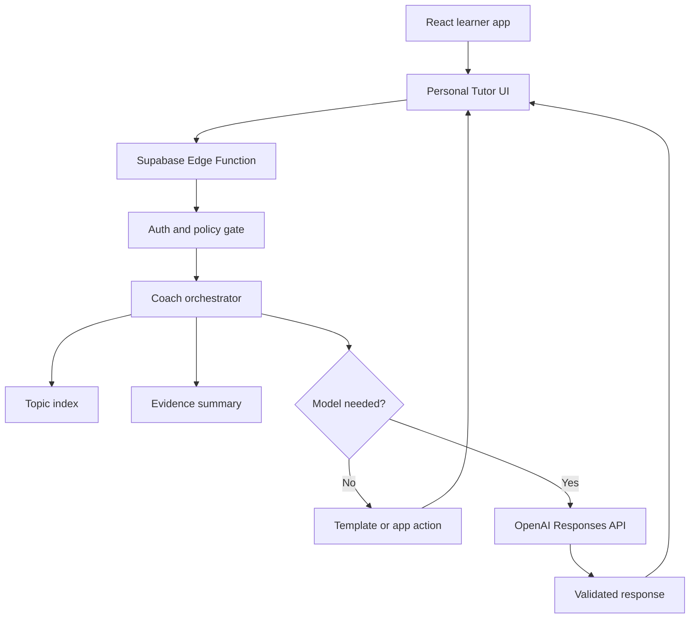

# Personal Tutor MVP Technical Design

## Decision sought

Approve a cost-controlled Personal Tutor pilot that feels like an ongoing tutoring relationship while using Revision's content packs, implemented deterministic recommendation engine and learning-evidence engine as the intelligence layer. The model is a bounded language and tutoring layer, not a second syllabus, recommendation engine or progress store.

This document proposes a design; it does not authorise implementation.

## Design principles

1. Revision decides; the model communicates.
2. Zero-model before small-model.
3. Retrieve the smallest relevant content packet; never send the syllabus.
4. Bound requests, context, output, retries, escalation and spend.
5. Keep every model credential server-side.
6. Model messages never create learning evidence.
7. Coach failure must not block ordinary revision.
8. Preserve approved structured tutoring memory across sessions without making indefinite raw transcript retention the default.

## Runtime architecture



### Browser

The React application owns presentation, explicit tutoring actions, current route/topic/activity context, a bounded in-session view of recent turns, approved structured tutoring memory, normal activity launches and accessible failure states.

It must not contain an OpenAI key, call OpenAI directly, send the full learner record/syllabus/transcript, decide model output is evidence, or request arbitrary tools.

### Supabase Edge Function

One authenticated Edge Function, provisionally `study-coach`, is the only model gateway. It owns:
- JWT verification;
- request and size validation;
- rate, turn and spend-limit enforcement;
- RLS-scoped learner evidence retrieval;
- deterministic content retrieval;
- assessment/assistance policy;
- prompt construction and model routing;
- OpenAI invocation;
- output-schema validation;
- usage telemetry; and
- safe failure behaviour.

The OpenAI key is an Edge Function secret and never appears in the browser or logs. Signed-in requests keep JWT verification enabled and use the learner's RLS-scoped auth context, consistent with [Supabase Edge Function auth guidance](https://supabase.com/docs/guides/functions/auth).

### Orchestrator

The orchestrator is tested TypeScript, not an autonomous agent. Each request performs one bounded turn:
1. validate learner and input;
2. resolve intent/topic;
3. enforce assistance level;
4. retrieve minimum content and, only where needed, a compact evidence summary;
5. decide whether a model is justified;
6. call the permitted model once;
7. validate the structured result;
8. return message, allowlisted actions and usage metadata.

No recursive planning, autonomous tool loop, model-selected database access or automatic paid retry exists in the MVP.

## Supported routing

| Intent | Default execution |
|---|---|
| Greeting/actions | No model |
| Continue activity | No model |
| Revision recommendation | Deterministic engine; optional short phrasing |
| Short approved definition | Template/content |
| Explain/diagnose/example | Luna |
| Short understanding check | Luna plus normal activity boundary |
| Protected assessment help | No answer-revealing model response |
| Non-study request | Deterministic redirect or approved safety path |

Buttons set intent directly. Free text uses topic aliases and keywords first. Ambiguity is resolved within the teaching call or by one clarifying question; do not buy a separate classification call.

## Content retrieval

Each content pack exposes a validated build-time index:

```ts
type CoachTopicEntry = {
  topicId: string
  aliases: string[]
  definition: string
  explanationChunks: string[]
  examples: string[]
  misconceptions: string[]
  diagnosticPrompts: string[]
  assessmentGuidance: string[]
  linkedTopicIds: string[]
  contentVersion: string
}
```

Retrieval uses exact aliases, keyword scoring and current route/topic. It returns the top topic plus only essential linked material. Subject knowledge remains in content, never shared engine code.

The AQA AS Business Paper 2 pilot deliberately excludes embeddings, vector storage and hosted file search. Structured deterministic retrieval is sufficient at current scale. Semantic retrieval is reconsidered only if measured retrieval failures justify its complexity and cost.

A grounding packet contains at most:
- active module/topic and content version;
- one definition;
- two explanation chunks;
- one example;
- relevant misconception/assessment guidance;
- permitted assistance level;
- compact evidence summary where needed;
- bounded recent state; and
- current learner input.

## Evidence boundary

Existing `learning_evidence` remains canonical.

For the pilot:
- the model has no evidence write capability;
- the coach may read a compact learner-owned summary;
- ordinary Revision activities launched by the coach create evidence through existing paths;
- chat answers may receive feedback but do not change readiness; and
- assisted and independent work remain distinguishable.

Direct coach-derived evidence is deferred until separately designed and assured.

## Context and output budgets

| Component | Target | Hard maximum |
|---|---:|---:|
| Policy/response contract | 600–900 tokens | 1,100 |
| Retrieved content | 500–900 | 1,200 |
| Evidence summary | 0–150 | 250 |
| Recent state/turns | 200–450 | 600 |
| Learner input | under 150 | 300 |
| Total input | under 2,200 | 4,000 |
| Learner-visible output | 80–180 | 250 |

The prompt includes a bounded recent exchange window plus structured tutoring state: topic, concepts understood, unresolved misconception, explanation strategies tried, assistance level and next goal. A running structured summary preserves continuity without resending or indefinitely storing the entire transcript.

Oversized requests are deterministically trimmed or turned into a clarifying question. Responses are schema-validated:

```ts
type CoachTurnResponse = {
  message: string
  intent: CoachIntent
  topicId: string | null
  grounding: {
    contentVersion: string
    topicIds: string[]
    sufficient: boolean
  }
  suggestedActions: Array<{
    type: "ask" | "launch_activity" | "show_content" | "end"
    label: string
    targetId?: string
  }>
  sessionState: {
    misconception?: string
    nextGoal?: string
  }
}
```

Actions are allowlisted. Invalid output fails closed without an automatic paid retry.

## Model strategy

Use `gpt-5.6-luna` through the Responses API, subject to the educational evaluation set proving it adequate. Use a verified pinned snapshot where available.

As of 17 August 2026, official pricing lists Luna at $0.20/million input tokens, $0.02/million cached input and $1.20/million output. Pricing is configuration and must be reverified before implementation. See [OpenAI API pricing](https://developers.openai.com/api/docs/pricing) and [GPT-5.6 Luna](https://developers.openai.com/api/docs/models/gpt-5.6-luna).

Default reasoning is none or the lowest level that passes evaluation. Web search, file search, code execution, image/audio generation and arbitrary tools are disabled.

Terra is allowed only after Luna shows a defined, measured failure class, a quality improvement is proven and a maximum escalation rate is configured. At most one server-authorised escalation may occur per session. Sol and model self-escalation are prohibited in the MVP.

Prompt caching is measured, not forced. Do not enlarge the stable prompt to exceed the 1,024-token eligibility threshold. Track cache reads and writes because GPT-5.6 cache writes cost more than ordinary input while reads cost less. See [Prompt caching](https://developers.openai.com/api/docs/guides/prompt-caching).

## Unit economics and limits

Indicative Luna token costs at current published prices:

| Example turn | Cost |
|---|---:|
| 1,200 input + 250 output | $0.00054 |
| 2,000 input + 300 output | $0.00076 |
| 4,000 input + 250 output | $0.00110 |

Fifty middle-case turns daily for 30 days are approximately $1.14 per fully active learner per month; one hundred are approximately $2.28, excluding retries, regional uplifts and other infrastructure.

Initial pilot controls:
- no ordinary per-session limit and no learner-visible turn counter;
- a hidden exceptional-use ceiling, initially 150 model-assisted turns per learner per day;
- one in-flight request per learner;
- zero automatic retries;
- one learner-initiated retry for a transient failure;
- 4,000-token input design ceiling;
- 250-token visible output ceiling;
- no Terra until explicitly enabled;
- dedicated project spend alerts and a hard monthly cap; and
- independent Tutor kill switch.

The exceptional-use ceiling is an abuse/cost backstop, not a product target. Normal conversation should end for educational reasons or learner choice, not because a small allowance expired.

Use a dedicated OpenAI project/key with the lowest practical hard monthly spend cap and lower alerts. Limits are server configuration, never client-controlled.

Telemetry records request ID, protected learner identifier, module/topic, model/snapshot, token categories, estimated/reconciled cost, latency, route, finish/error category, quality outcome and completion of a normal next action. Avoid raw text. The commercial metric is **model cost per successful coached learning outcome**.

## Privacy and under-18 safety

The pilot retains approved structured tutoring memory across sessions so the learner can resume a topic. The memory contains learning context, not claims of mastery: topic, concepts understood in conversation, unresolved misconceptions, explanations tried, assistance received, next goal and relevant evidence references.

Raw transcript retention beyond the active session is excluded by default unless privacy/safeguarding authority later approves a defined purpose, retention period and learner controls.

It must not launch until authority defines lawful basis, retention/deletion, parent visibility, non-study/safeguarding boundaries, incident response and provider data handling.

OpenAI states API data is not used for training unless the customer opts in, but default abuse-monitoring logs may retain customer content for up to 30 days. The privacy assessment must not claim “no retention.” See [OpenAI data controls](https://developers.openai.com/api/docs/guides/your-data).

Because learners may be under 18, implementation must complete a review against current [OpenAI Under 18 API Guidance](https://developers.openai.com/api/docs/guides/safety-checks/under-18-api-guidance).

Safety is layered through narrow intents, input limits, protected-assessment rules, prompt-injection tests, approved high-risk handling, provider safeguards, structured output/action allowlists, reporting and a kill switch.

## Supabase data rules

No schema migration is approved here.

If later implementation adds structured Tutor memory, usage or session tables:
- inspect live schema first;
- separate structured tutoring memory from raw transcripts and learning evidence;
- create a version-controlled migration;
- explicitly configure Data API grants because new tables are no longer auto-exposed by default;
- enable RLS and learner ownership policies;
- exclude raw transcripts from usage telemetry;
- define retention/deletion; and
- run advisors and database tests.

See the current [Supabase breaking-change register](https://supabase.com/changelog?tags=breaking-change).

## Failure behaviour

| Failure | Behaviour |
|---|---|
| Provider unavailable | Explain; keep core revision working |
| Invalid output | Safe response; no automatic retry |
| Missing grounding | Disclose limitation and offer content navigation |
| Insufficient evidence | Offer normal diagnostic activity |
| Exceptional-use ceiling reached | Explain fair-use pause and offer non-model activity |
| Spend cap/kill switch | Disable coach only |
| Auth failure | Re-authenticate before any model call |
| Restricted request | Approved redirect/safety response |

## Assurance

Unit/contract tests cover routing, retrieval, packet size, assistance policy, evidence minimisation, token trimming, escalation prohibition, action allowlists, cost calculation, limits, auth/RLS, mocked provider calls, output validation, errors, secret absence and no coach-driven evidence writes.

A versioned AQA Business evaluation set covers known questions, ambiguous language, misconceptions, alternative explanations, application/exam links, missing grounding, protected-answer requests, prompt injection, non-study/safety inputs and incorrect learner claims.

Score correctness, grounding, educational usefulness, age-appropriate tone, concision, misconception handling, answer leakage, unsafe completion, action validity and cost. Luna must pass explicit thresholds; an expensive model is not the automatic fix for bad retrieval or prompting.

Playwright covers phone/tablet/desktop open-close state, dismissal, loading/errors/limits, accessibility, assessment restrictions, failure with continued revision and layout integrity.

## Delivery sequence

1. **Evaluation harness:** build topic-index contract, retrieval, prompt/output schemas and synthetic evaluation; no learner exposure.
2. **Jamie pilot:** five intents, Business Paper 2, ongoing conversation, approved structured cross-session memory, Luna only, no coach evidence writes, hidden exceptional-use controls and an approved review process.
3. **Evidence-guided mode:** connect the deterministic recommendation capability already implemented on `main` to **Guide me** and Tutor explanations.
4. **Controlled expansion:** only after quality, safety, privacy and economics pass; consider direct Tutor evidence, more modules, Terra, semantic retrieval or commercial entitlements separately.

## Implementation prerequisites

Before implementation:
1. Founder approves capability, journey and this design.
2. Privacy, safeguarding and AI-use authority is approved.
3. Provider and pilot budget are approved.
4. Live Supabase and Edge Function configuration are re-inspected.
5. Model snapshot, API schema and pricing are reverified.
6. An ADR records the external-model gateway and deterministic retrieval decision.
7. Evaluation thresholds and rollback criteria are agreed.

## Documentation impact

Approval requires later updates to Technology Stack, an ADR, privacy/safeguarding/AI-use authority, Target Data Model if tables are introduced, and implementation documentation. Until those governed changes occur, this remains a draft and no implementation is implied.
