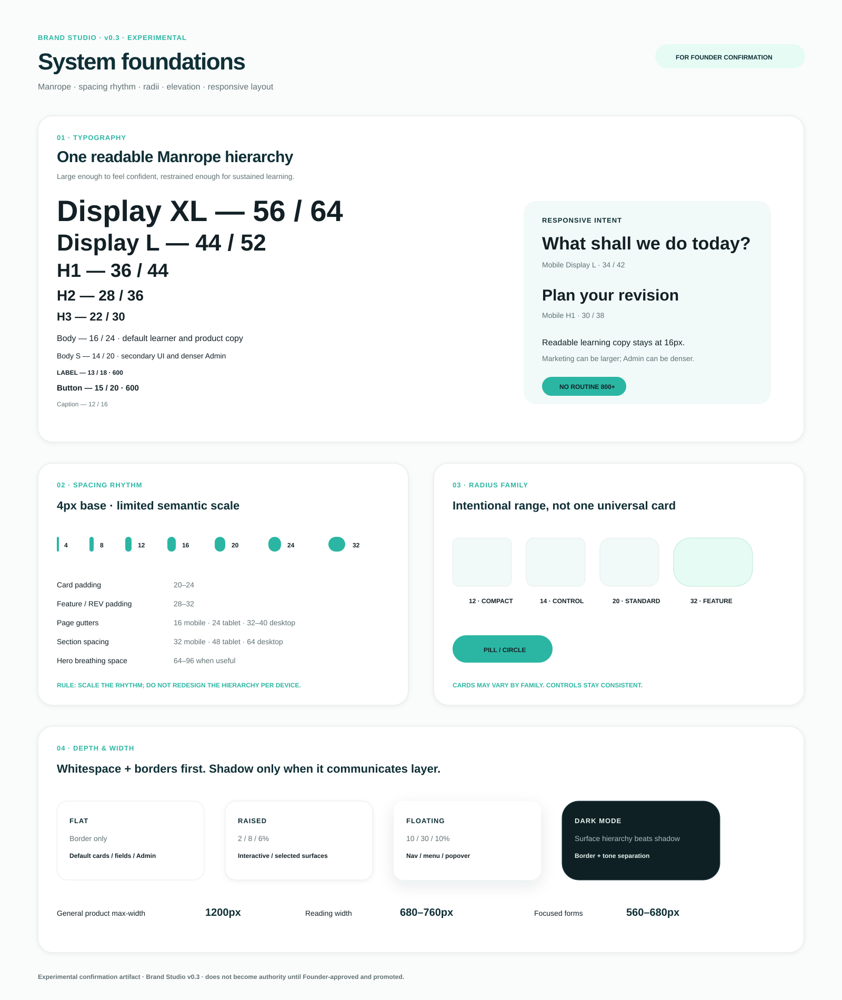
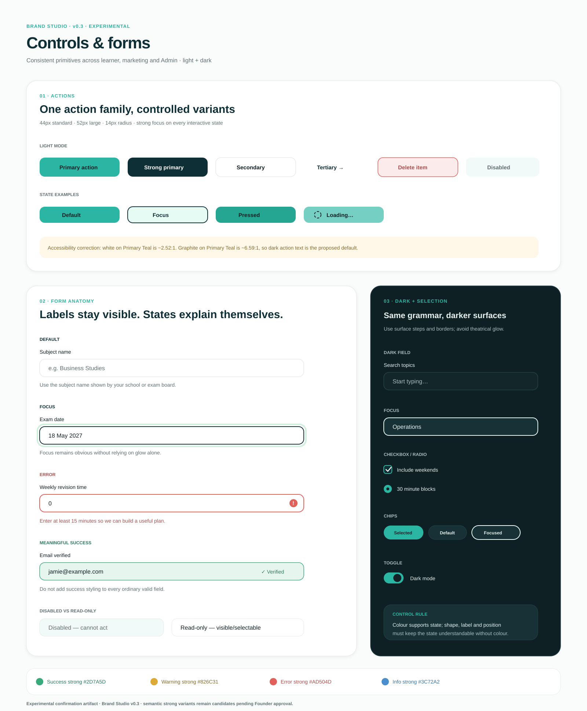
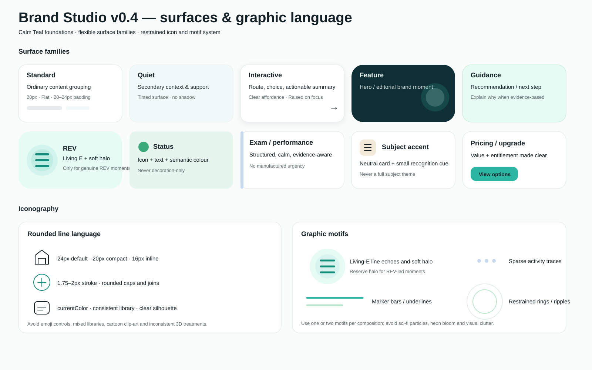
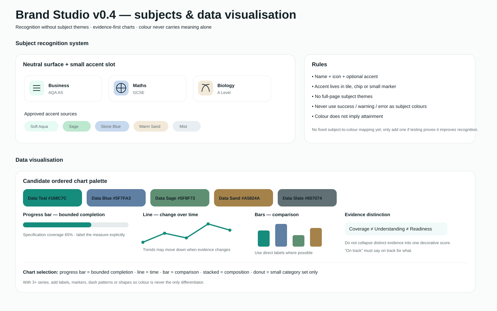
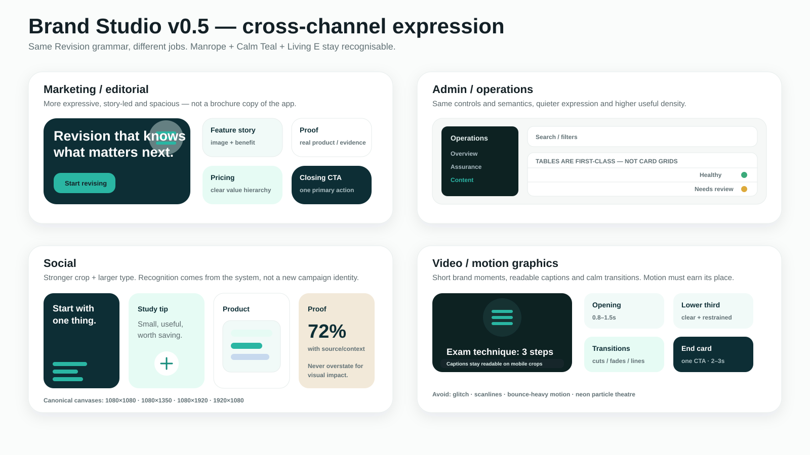
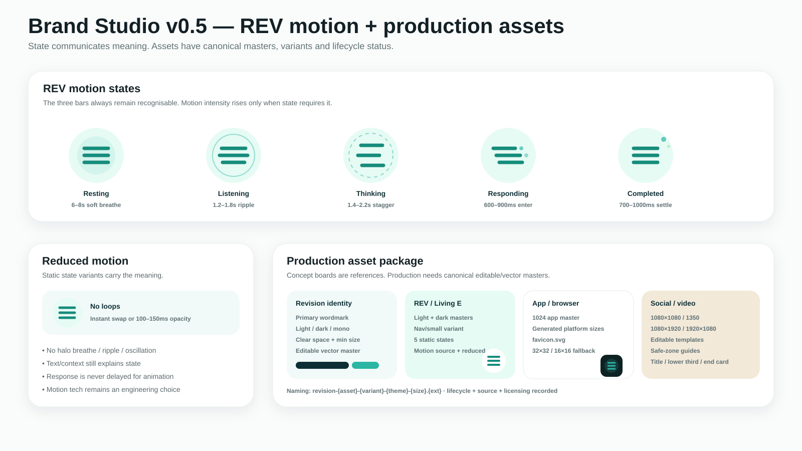

# Brand Studio — visual confirmation workspace

**Status:** Major brand grammar Founder-approved through v0.5; production-readiness work next  
**Authority:** This folder is visual evidence/reference. Canonical policy lives in `20-brand-and-experience/Visual Brand System.md`.  
**Related PR:** #75

## Purpose

Provide a single visual place to inspect Revision's approved brand grammar, design history and production-readiness requirements.

## Founder-confirmed foundations — 20 August 2026

Locked direction:

- **Typeface:** Manrope.
- **Core visual palette:** Calm Teal.
- **REV identity:** Living E — three horizontal bars with a soft halo.
- **REV states:** Resting, Listening, Thinking, Responding and Completed.
- **Themes:** light and dark are both first-class applications of one brand system.
- **Homepage:** spacious REV-led composition across mobile, tablet and desktop.
- **Mobile navigation:** Home / Plan / REV / Progress / Subjects with Living E in the centre.
- **Cross-audience intent:** contemporary and student-relevant while calm, credible and trustworthy for parents/supporting adults.

### Approved Calm Teal palette

Core:
- Deep Teal Ink `#0F2F36`
- Primary Teal `#2BB6A3`
- Soft Aqua Accent `#E6FBF4`
- Canvas Off-White `#FAFCFB`
- Soft Surface Tint `#F1FAF8`
- Graphite Ink `#132026`

Supporting:
- Sage `#BCE8CF`
- Stone Blue `#C7D9EE`
- Warm Sand `#F2E9D9`
- Mist `#E9EEF2`

Functional source colours:
- Success `#3BAA7A`
- Warning `#DDAA3A`
- Error `#E0605A`
- Information `#4A8ECB`

## v0.3 — Founder-approved reusable foundations

Promoted into the Brand System:

- Manrope role-based type scale with 16px learner body;
- 4px spacing rhythm and 16 / 24 / 32–40px responsive gutters;
- `12 / 14 / 20 / 32 / pill` radius family;
- Flat / Raised / Floating / Overlay elevation model;
- 44px standard and 52px major CTA controls;
- Primary Teal + Graphite as default accessible primary action;
- consistent field anatomy and interaction states; and
- stronger accessible semantic foregrounds and pale semantic surfaces.

### Typography, spacing, shape and depth

### Controls and forms

Detailed specification: [`brand-studio-foundations-controls-v0.3.md`](brand-studio-foundations-controls-v0.3.md).

## v0.4 — Founder-approved surfaces, icons, subjects and data

### Surfaces and iconography

Confirmed direction:

- Standard, Quiet, Interactive, Feature, Guidance, REV, Status, Exam/Performance, Subject Accent and Pricing/Upgrade surface families;
- 20px standard / 32px feature expression rather than one universal card;
- rounded line icons at 24px default, 20px compact and 16px inline;
- 1.75–2px rounded icon strokes;
- restrained Living-E-derived motifs;
- halo remains a REV-specific identity device rather than general decoration.

### Subject accents and data visualisation

Confirmed direction:

- subject recognition uses name + icon + optional small accent cue;
- no fixed subject-to-colour mapping unless testing proves it useful;
- evidence-first chart selection;
- coverage, understanding/mastery evidence, exam readiness and plan progress remain distinct;
- approved derived data series: `#168C7C`, `#5F7FA3`, `#5F8F73`, `#A5824A`, `#607074`;
- direct labels/markers/patterns supplement colour for multi-series charts.

Detailed specification: [`brand-studio-surfaces-icons-data-v0.4.md`](brand-studio-surfaces-icons-data-v0.4.md).

## v0.5 — Founder-approved cross-channel application

The Founder approved the v0.5 direction on 20 August 2026. Its recurring rules are promoted into Brand System v0.9.

Confirmed direction:

- seven marketing/editorial pattern families: Hero, Feature Story, Product Proof, Pricing, Proof/Testimonial, Editorial/Guide and Closing CTA;
- Admin shell/table/filter/status/destructive rules using shared primitives with denser expression;
- five social format families using canonical 1080×1080, 1080×1350, 1080×1920 and 1920×1080 working canvases;
- video opening/title/lower-third/caption/demo/end-card/transition system;
- simplified email/lifecycle treatment using the same foundations.

## v0.5 — Founder-approved REV motion and production assets

Confirmed direction:

- Resting: 6–8s subtle breathe;
- Listening: 1.2–1.8s restrained ripple/equalised response;
- Thinking: 1.4–2.2s controlled stagger/ring loop;
- Responding: 600–900ms state entry without delaying text;
- Completed: 700–1000ms settle;
- reduced-motion removes loops and uses static states / very short opacity changes;
- production requires editable/vector Revision wordmark and Living E masters, light/dark/mono/static-state variants, app/favicon exports, canonical motion source and editable social/video templates;
- canonical asset names follow `revision-{asset}-{variant}-{theme}-{size}.{ext}` with lifecycle/source/export/licensing records.

Detailed specification: [`brand-studio-channels-motion-assets-v0.5.md`](brand-studio-channels-motion-assets-v0.5.md).

## Brand grammar status

The major recurring brand grammar is now defined. Brand Studio should no longer expand rules merely to create more examples. New recurring visual rules require deliberate governance only when a genuine gap is identified.

## Navigation clarification

Concept artwork does not override product Information Architecture. The governed desktop and mobile destinations remain:

**Home / Plan / REV / Progress / Subjects**

## Production-readiness work still required

The next stage is production rather than further brand exploration:

1. obtain/create canonical editable vector Revision wordmark and Living E masters;
2. derive approved light/dark/mono/static-state/app/favicon exports;
3. select/create the canonical REV motion source and production implementation;
4. create editable social/video templates and safe-zone guides;
5. record canonical asset source/export/licensing/lifecycle metadata;
6. decide whether to implement Brand Studio as a live internal reference surface; and
7. refactor current product tokens/components/CSS and migrate learner, marketing and Admin surfaces under governed implementation PRs.

## Pattern status vocabulary

Use **Recommended**, **Alternative**, **Experimental**, **Deprecated** or **Do not use**.

## Previous exploration boards — design history

Earlier v0.1/v0.2 boards remain design-history evidence and do not override Calm Teal, Manrope or Living E where they conflict.

### v0.2 — identity and typography

### v0.2 — expressive colour and semantic status

### v0.1 — foundations and primitives

### v0.1 — cross-channel expression

