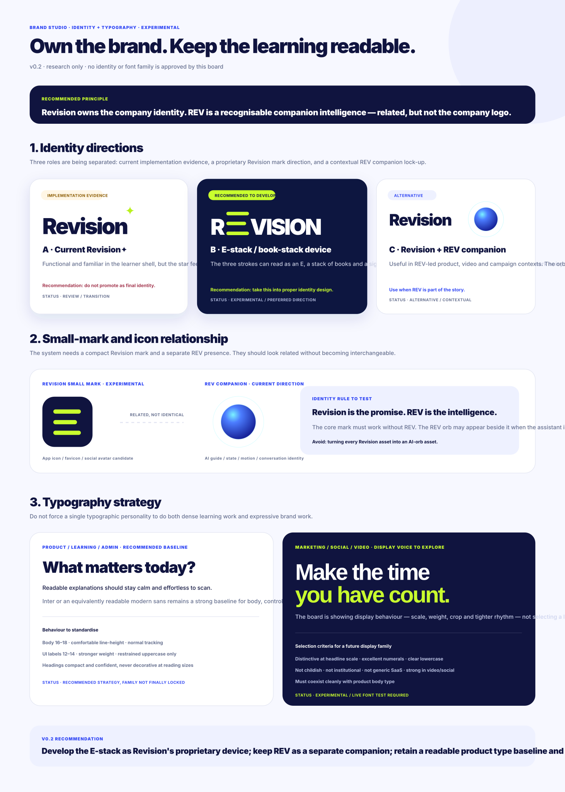
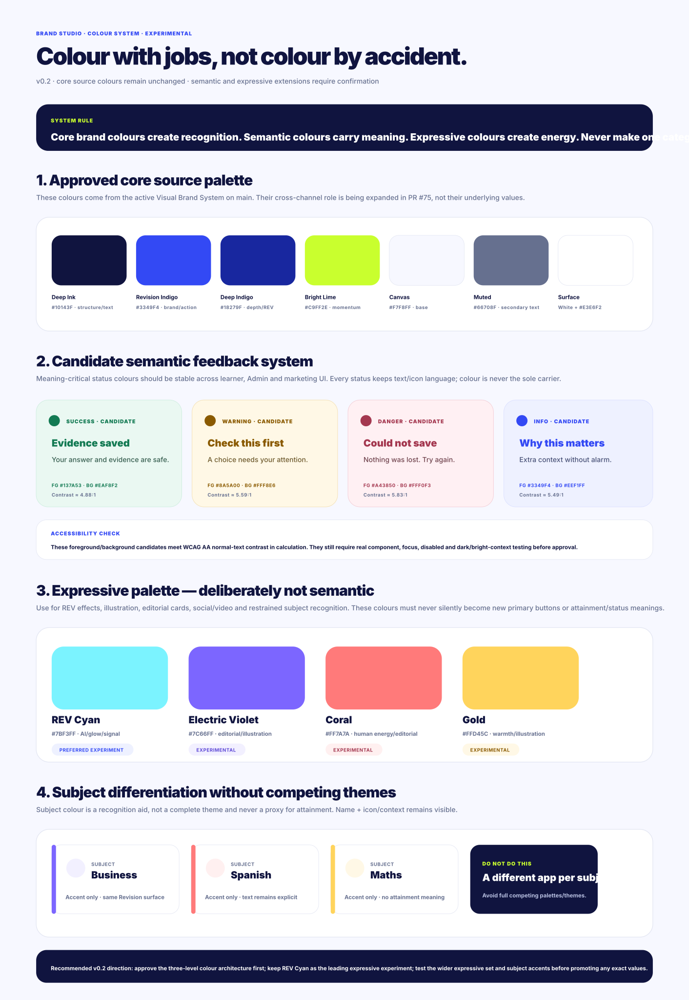
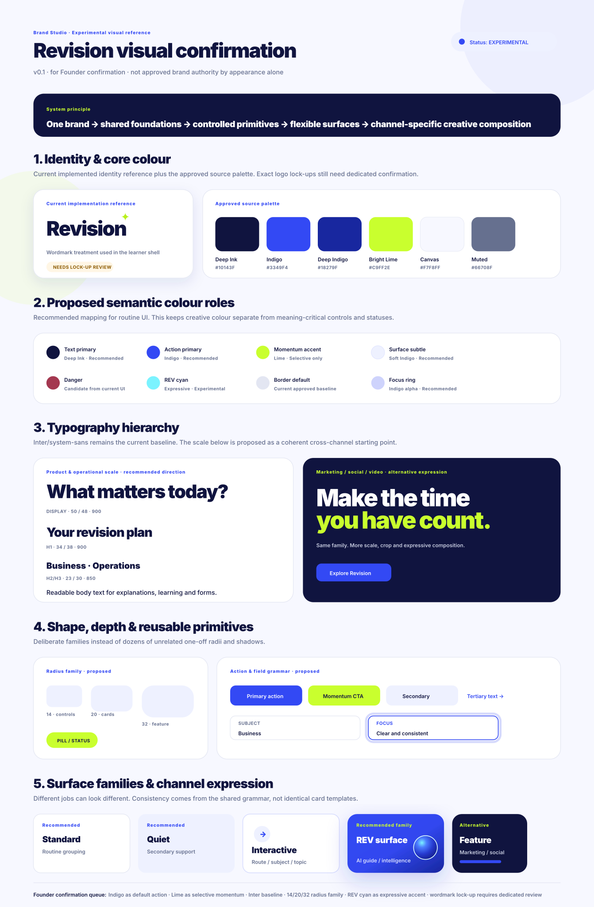
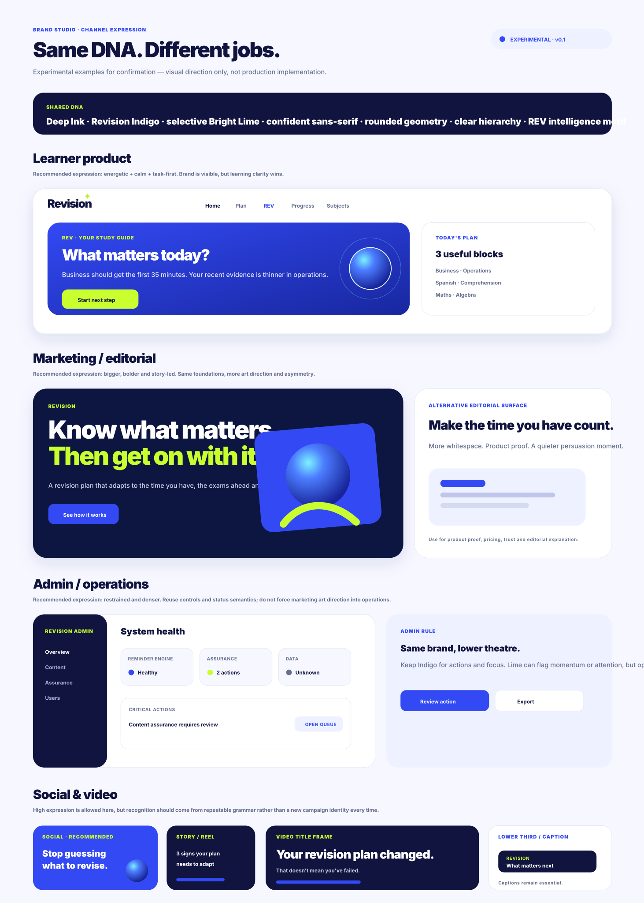

# Brand Studio — visual confirmation workspace

**Status:** Founder-confirmed foundations; remaining system work in progress  
**Authority:** This folder is visual evidence/reference. Canonical policy lives in `20-brand-and-experience/Visual Brand System.md`.  
**Related PR:** #75

## Purpose

Provide a single visual place to inspect Revision's approved brand grammar, remaining open design-system decisions and channel-specific examples.

## Founder-confirmed foundations — 20 August 2026

The Founder has now locked the following direction:

- **Typeface:** Manrope.
- **Core visual palette:** Calm Teal, replacing the earlier indigo/lime exploration.
- **REV identity:** Living E — three horizontal bars with a soft halo.
- **REV states:** Resting, Listening, Thinking, Responding and Completed.
- **Themes:** light and dark are both first-class applications of the same brand system.
- **Homepage:** spacious REV-led composition across mobile, tablet and desktop, with greeting/prompt, REV input, quick actions and continue/recent context beneath.
- **Mobile navigation:** Home / Plan / REV / Progress / Subjects with Living E in the centre.
- **Cross-audience intent:** contemporary and student-relevant while remaining calm, credible and trustworthy for parents/supporting adults.

### Approved Calm Teal palette

Core:

- Deep Teal Ink `#0F2F36`
- Primary Teal `#2BB6A3`
- Soft Aqua Accent `#E6FBF4`
- Canvas Off-White `#FAFCFB`
- Soft Surface Tint `#F1FAF8`
- Graphite Ink `#132026`

Supporting:

- Sage `#BCE8CF`
- Stone Blue `#C7D9EE`
- Warm Sand `#F2E9D9`
- Mist `#E9EEF2`

Functional:

- Success `#3BAA7A`
- Warning `#DDAA3A`
- Error `#E0605A`
- Information `#4A8ECB`

See the canonical Brand System for the light/dark theme token mapping.

## What previous boards now mean

Earlier v0.1/v0.2 boards remain useful exploration/history but no longer represent the leading brand direction where they conflict with the Founder-confirmed Calm Teal system.

In particular:

- Indigo/Lime as the principal brand palette is superseded by Calm Teal.
- REV Cyan/Violet/Coral/Gold exploration is not approved as the main expressive system.
- Inter/typeface exploration is superseded by Manrope.
- the earlier E-stack/book-stack exploration is superseded by the Founder-confirmed Living E + soft halo treatment.

Do not delete these artifacts; they remain valid design-history evidence.

## Navigation clarification

The supplied responsive homepage board is approved for visual layout, but concept artwork does not override product Information Architecture.

The governed desktop and mobile destinations remain:

**Home / Plan / REV / Progress / Subjects**

A desktop mock-up that omits a separate REV navigation label should be interpreted as a visual concept only; production must preserve the genuine REV destination.

## Current system work still to define

With the foundations locked, Brand Studio should now focus on the remaining reusable system rather than reopening the core look:

1. production logo/REV asset masters, lock-ups, clear-space and minimum-size rules;
2. exact Manrope hierarchy, weights, line heights and responsive type scale;
3. spacing rhythm, radii, borders and elevation/shadow families;
4. complete button/control states;
5. complete form anatomy and validation/loading/disabled states;
6. card and surface families with `use when` / `avoid when` guidance;
7. iconography and illustration/graphic-language rules;
8. subject-accent strategy and exact mapping if needed;
9. data visualisation and progress/status treatment;
10. marketing-site pattern families;
11. Admin/operations pattern families;
12. social format families;
13. video/motion title, lower-third, caption and transition rules;
14. REV motion timing/easing and reduced-motion equivalents; and
15. canonical asset naming, export sizes/formats, editable-source and licensing rules.

## Pattern status vocabulary

Use:

- **Recommended** — default for the stated job;
- **Alternative** — approved when context justifies it;
- **Experimental** — visible for evaluation but not reusable authority;
- **Deprecated** — retained during migration/history but not for new work; or
- **Do not use** — rejected/non-compliant.

## Existing exploration boards

### v0.2 — identity and typography

### v0.2 — expressive colour and semantic status

### v0.1 — foundations and primitives

### v0.1 — cross-channel expression

These boards are retained as design history. The Founder-confirmed Calm Teal direction takes precedence where they differ.